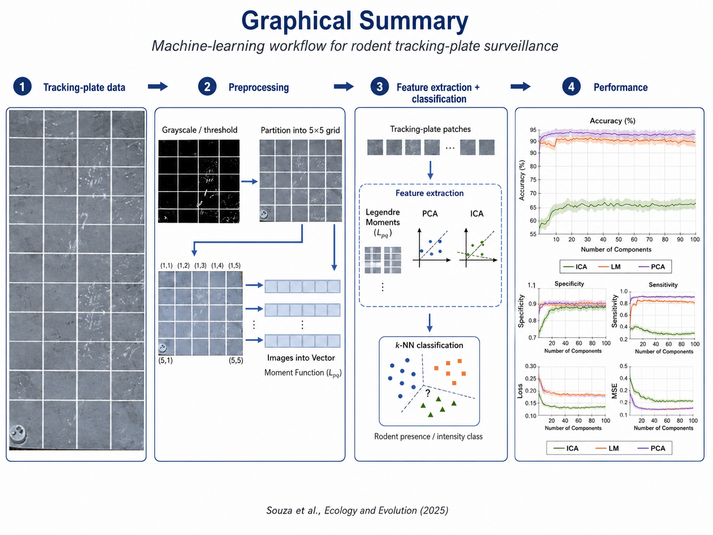

# Machine Learning Pipeline for Rodent Tracking-Plate Surveillance

This repository contains the code and documentation associated with the image-processing and machine-learning workflow used in the study:

**Souza, F. N., Awoniyi, A. M., da Silva, R. D. C., Nery Jr, N., Oliveira, M. V. M., Zeppelini, C. G., The, G. A. P., Hacker, K., Eyre, M. T., Argibay, H. D., Ko, A., Costa, F., & Khalil, H. (2025). _Incorporating Machine Learning Techniques to Enhance Rodent Surveillance in Marginalized Urban Communities_. Ecology and Evolution, 15(11), e72382. https://doi.org/10.1002/ece3.72382**

## Overview

Rodent surveillance is important for public health, disease ecology, and the monitoring of rodent-borne zoonotic risk. Traditional tracking-plate interpretation can be time-consuming and dependent on trained human observers.

This project applies image-processing and machine-learning methods to classify grayscale tracking-plate images. The workflow includes image preprocessing, feature extraction using Legendre Moments, PCA and ICA, and classification using the k-nearest neighbors algorithm.

The goal of this repository is to make the computational workflow easier to inspect, reuse, and cite.

## Graphical summary



## Methods included

The repository includes MATLAB scripts for:

- grayscale image preprocessing;
- global thresholding;
- subdivision of each image into a 5 × 5 grid of sub-images;
- Legendre Moment feature extraction;
- Principal Component Analysis;
- Independent Component Analysis;
- k-nearest neighbors classification;
- evaluation using accuracy, sensitivity, specificity, classification loss, mean squared error, and ROC curves.

## Repository structure

```text
rodent-surveillance-machine-learning/
│
├── README.md
├── LICENSE
│
├── code/
│   ├── README.md
│   ├── image_preprocessing.m
│   ├── extract_legendre_moments.m
│   ├── LM.m
│   ├── pca_ica_feature_extraction.m
│   ├── knn_classification_features.m
│   └── knn_classification_trainingsize image_preprocessing.m
│   ├── extract_legendre_moments.m
│   ├── LM.m
│   ├── pca_ica_feature_extraction.m
│   └── README.md
│
└── data/
    └── README.md
